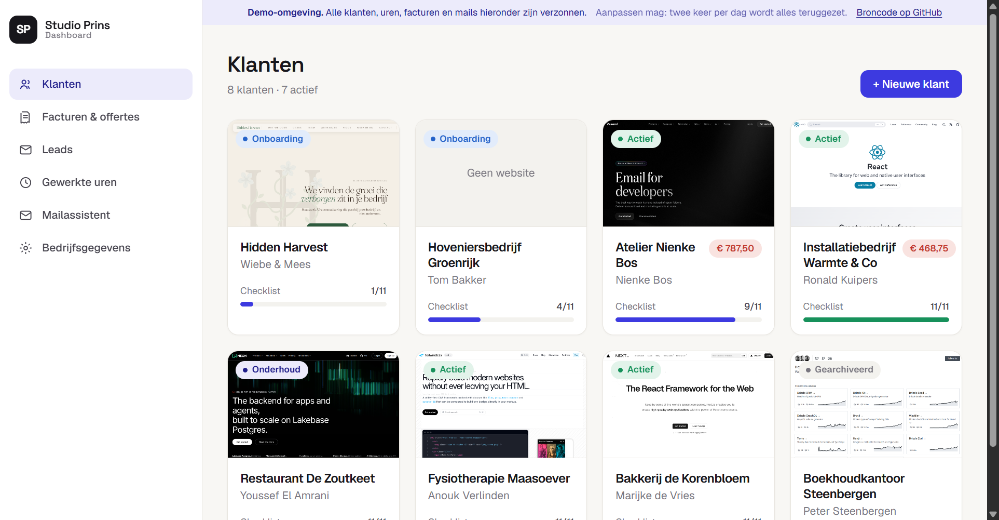
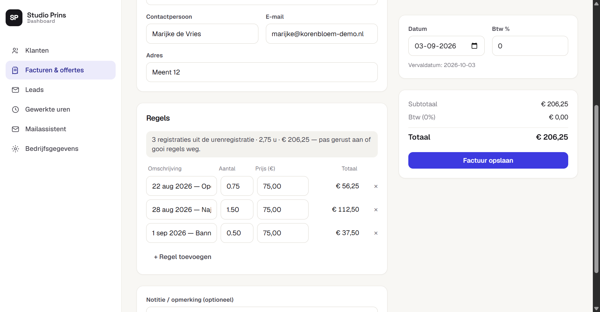
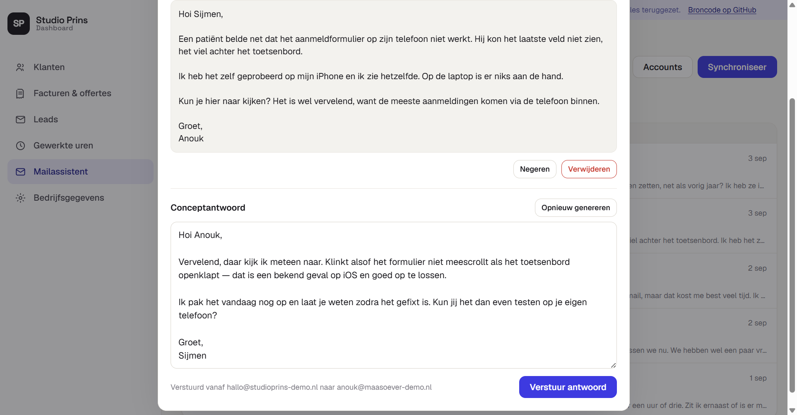
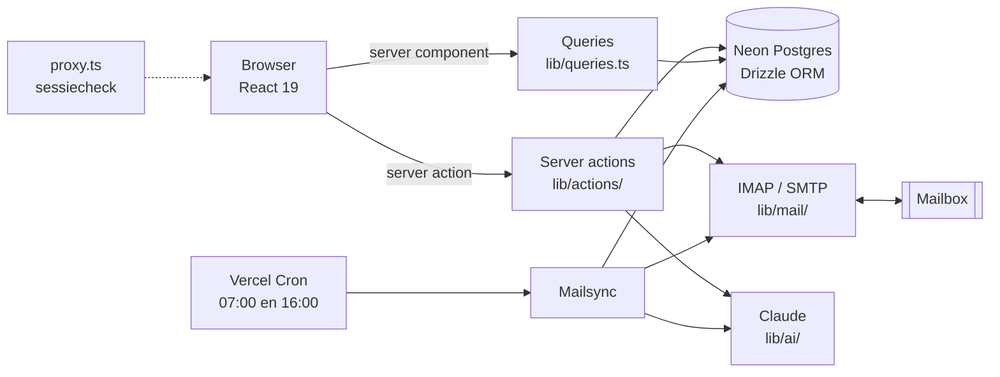

# Studio Prins — Dashboard

Het interne dashboard waarmee ik mijn webdesignbureau draai. Klanten en hun
onboarding, geregistreerde uren, facturen en offertes met PDF, en een
mailassistent die mijn inbox sorteert en conceptantwoorden schrijft in mijn eigen
stijl.

Dit is geen oefenproject. Er gaan echte facturen uit, echte klanten vullen het
intakeformulier in, en twee keer per dag haalt een cron mijn mailbox op.

**[→ Demo bekijken](https://studio-prins-dashboard-demo.vercel.app)** — geen
inlog nodig, alle data is verzonnen en wordt twee keer per dag teruggezet.

*Openstaande uren van een klant verschijnen automatisch als factuurregels — nog steeds gewoon aan te passen.*

*De mailassistent sorteert de inbox in vijf categorieën en schrijft op verzoek een conceptantwoord in mijn eigen schrijfstijl.*

---

## Wat het doet

| | |
| --- | --- |
| **Klanten** | Overzicht met een live screenshot van de klantwebsite, voortgang op de onboarding-checklist en het openstaande bedrag. Per klant een detailpagina met intake-antwoorden, facturen en een Google Drive-map. |
| **Onboarding** | Eén klik stuurt de klant een mail met een intakeformulier op een geheim token. Wat hij invult landt direct op de juiste kolommen — de facturatiegegevens hoef ik nooit over te typen. |
| **Gewerkte uren** | Registratie per teamlid, op een klant of op bedrijfswerk, met verdiensten per maand. De invoer accepteert `2`, `2,5`, `1:30` en `90m`. |
| **Facturen & offertes** | Eén documentmodel met twee jaarreeksen, PDF-generatie, en een offerte die je met één klik omzet naar een factuur. Openstaande uren van een klant verschijnen automatisch als factuurregels. |
| **Mailassistent** | Haalt ongelezen mail op via IMAP, verdeelt die over vijf categorieën, en schrijft op verzoek een conceptantwoord in mijn schrijfstijl. Antwoorden gaan via SMTP de deur uit en belanden netjes in Verzonden. |
| **Leads** | Handmatige lijst met statuspipeline en een demo-URL per lead. |

## Architectuur

Pagina's zijn dunne server components die data ophalen en doorgeven; alle
mutaties lopen via server actions. Beveiliging zit niet alleen in de proxy maar
ook in elke query en elke action apart — `requireSession()` staat overal
bovenaan, met twee gedocumenteerde uitzonderingen voor het publieke
intakeformulier.

## Drie beslissingen die ik zou uitleggen in een code review

**1. Een gratis filter vóór de betaalde AI.**
Elke binnenkomende mail door een taalmodel halen is onnodig duur. Er draait
eerst een regelgebaseerde vóórfilter ([`lib/mail/prefilter.ts`](lib/mail/prefilter.ts))
die nieuwsbrieven herkent aan afmeldtaal en systeemmail aan het afzenderadres.
Die filter is bewust conservatief: hij kent nóóit "belangrijk" of "onbelangrijk"
toe, want dat vraagt inhoudelijk oordeel. Eén klantmail die als ruis wordt
weggezet kost meer dan alle bespaarde API-calls samen — dat staat vastgelegd in
een test. Wat overblijft gaat naar Haiku om te classificeren; alleen het
schrijfwerk gaat naar Sonnet. Opus heb ik er weer uit gehaald toen bleek dat de
mails er niet beter van werden.

**2. Een vangrail tegen dubbel factureren.**
Uren worden afgeboekt met `WHERE id IN (...) AND invoice_id IS NULL`. Die tweede
voorwaarde is het hele punt: twee tabbladen die tegelijk dezelfde factuur
opslaan kunnen een uur niet twee keer in rekening brengen. Andersom geeft
`ON DELETE SET NULL` de uren automatisch weer vrij als de factuur wordt
verwijderd, zonder opruimcode.

**3. IMAP is rommeliger dan de documentatie doet vermoeden.**
UID's zijn alleen geldig zolang `UIDVALIDITY` niet verspringt; gebeurt dat wel,
dan valt de sync terug op ontdubbelen via `Message-ID`. En omdat ik mijn mail
ook op mijn telefoon lees, loopt de afstemming twee kanten op: wat elders
gelezen is verdwijnt uit het dashboard, en wat ik hier afhandel wordt op de
server als gelezen gemarkeerd. Bij het versturen van een antwoord is het
onderscheid tussen fataal en niet-fataal expliciet: mislukt SMTP, dan is dat een
harde fout — mislukt de kopie in Verzonden ná een geslaagde verzending, dan gaat
de status tóch op "beantwoord", anders verstuurt een retry de mail twee keer.

## Hoe ik dit gebouwd heb

Ik studeer econometrie en ben geen opgeleide software-engineer. Ik bouw al langer
websites, en dit dashboard is ontstaan uit ergernis: klantgegevens in een
spreadsheet, facturen in Word, en een inbox die ik 's avonds nog moest uitzoeken.

Ik heb het gebouwd met Claude Code, en daar ben ik niet geheimzinnig over. Wat ik
in die zeven weken vooral geleerd heb, is dat de kwaliteit niet in het
genereren zit maar in het beoordelen. De drie beslissingen hierboven zijn geen
dingen die er vanzelf uitkwamen: de vóórfilter kwam er nadat ik naar mijn
API-rekening keek, de `invoice_id IS NULL`-voorwaarde nadat ik me afvroeg wat er
gebeurt als ik twee tabbladen open heb, en de UIDVALIDITY-afhandeling nadat de
sync een keer alles dubbel binnenhaalde.

Wat ik nog niet heb, noem ik er meteen bij: er is geen Python of FastAPI in dit
project. Ik schrijf Python voor mijn studie — statistiek, data — maar nog niet
als productieservice. Dat is het eerste dat ik zou willen leren.

De commitgeschiedenis loopt van 17 juli tot nu en is niet opgepoetst. Je ziet er
de cron van elk uur naar twee keer per dag gaan omdat het Hobby-plan dat niet
toestaat, en je ziet Opus eruit vliegen omdat het niet beter werd.

## Stack

- **Next.js 16** (App Router, Turbopack) + React 19 + TypeScript
- **Tailwind CSS v4** — eigen design-systeem in [`app/globals.css`](app/globals.css)
- **Neon Postgres** + **Drizzle ORM** ([`lib/db/`](lib/db))
- **Claude** via `@anthropic-ai/sdk` — Haiku voor classificatie, Sonnet voor tekst
- **imapflow** / **mailparser** / **nodemailer** voor de mailkant
- **@react-pdf/renderer** voor facturen ([`lib/pdf/`](lib/pdf))
- **Auth**: `jose`-sessiecookie, afgedwongen in [`proxy.ts`](proxy.ts) én in elke query
- **Vitest** voor het rekenwerk, **GitHub Actions** voor lint, types, tests en build

Bedragen staan overal in hele centen en tijd in hele minuten, zodat optellen
exact blijft.

## Lokaal draaien

1. `npm install`
2. Maak een gratis **Neon**-database aan en kopieer de connectie-string.
3. Kopieer `.env.example` → `.env.local` en vul in (let op de opmerking over het
   escapen van `$` in de wachtwoord-hash).
4. `npm run db:push` — zet de tabellen klaar.
5. `npm run db:seed` — een beetje voorbeelddata (optioneel).
6. `npm run dev` — open http://localhost:3000

| Script | Doel |
| --- | --- |
| `npm run dev` | Ontwikkelserver |
| `npm run build` | Productiebuild |
| `npm test` | Tests (`npm run test:watch` om mee te kijken) |
| `npm run typecheck` | `tsc --noEmit` |
| `npm run lint` | ESLint |
| `npm run db:push` | Schema naar de database sturen |
| `npm run db:seed` | Kleine voorbeelddataset |
| `npm run db:demo-seed` | Volledige demo-dataset (**wist eerst alles**) |
| `npm run db:studio` | Drizzle Studio |

## De demo-omgeving

De demo draait dezelfde code als productie, met `NEXT_PUBLIC_DEMO=1`. Wat er
anders is:

- **Geen inlog.** `getSession()` geeft een vaste sessie terug, zodat
  `requireSession()` overal ongewijzigd blijft werken.
- **Schrijven mag.** Klanten aanmaken, uren boeken, facturen maken: het werkt
  allemaal echt. Twee keer per dag zet een cron de data terug.
- **Niets kan naar buiten.** De demo-deploy heeft geen `ANTHROPIC_API_KEY`,
  `MAIL_SECRET`, `RESEND_API_KEY` en geen Google-credentials. Zonder die
  sleutels kán er geen mail verstuurd worden en geen IMAP-verbinding opgezet —
  ook niet als ik ergens een controle vergeet. De zes acties die de buitenwereld
  raken tonen een uitleg in plaats van een foutmelding.
- **Verzonnen data.** Acht klanten, vijf leads, 62 uurregistraties, acht
  documenten en een mailbox van 25 berichten. De conceptantwoorden zijn vooraf
  gegenereerd met dezelfde prompt, zodat een publieke pagina geen API-tegoed kan
  opmaken.

Zelf opzetten: aparte Neon-database, tweede Vercel-project op deze repo, en
alleen `DATABASE_URL`, `SESSION_SECRET`, `CRON_SECRET` en `NEXT_PUBLIC_DEMO=1`
als omgevingsvariabelen. Daarna `npm run db:push` en `npm run db:demo-seed`.

## Deploy

1. Importeer de repo in Vercel.
2. Voeg via **Vercel Marketplace → Neon** een database toe (zet `DATABASE_URL`).
3. Zet de overige variabelen in **Settings → Environment Variables** (zie de
   tabel hieronder).
4. Na de eerste deploy: `npm run db:push` tegen de productie-`DATABASE_URL`.

> `.env.local` geldt **alleen lokaal** en staat in `.gitignore`; online wordt dat
> bestand nooit gelezen. Elke variabele moet dus apart in Vercel staan, en een
> nieuwe of gewijzigde variabele werkt pas ná een nieuwe deploy
> (Deployments → ⋯ → Redeploy).

| Variabele | Waarvoor | Zonder deze |
| --- | --- | --- |
| `AUTH_EMAILS` | Toegestane inlog-adressen (komma-gescheiden) | Niemand kan inloggen |
| `AUTH_PASSWORD_HASH` | bcrypt-hash — **rauw** op Vercel, `\$`-escaped in `.env.local` | Idem |
| `SESSION_SECRET` | Ondertekening sessiecookie | Idem |
| `DATABASE_URL` | Neon Postgres | Niets werkt |
| `RESEND_API_KEY`, `RESEND_FROM` | Onboardingmail via Resend | "E-mailverzending is nog niet ingesteld" |
| `APP_BASE_URL` | Basis-URL voor links in de mail (productie-URL, geen localhost) | Valt terug op de Vercel-productie-URL |
| `GOOGLE_CLIENT_ID`, `GOOGLE_CLIENT_SECRET`, `GOOGLE_REFRESH_TOKEN`, `GOOGLE_DRIVE_PARENT_FOLDER_ID` | Drive-map per klant | Mail gaat zonder Drive-link |
| `ANTHROPIC_API_KEY` | Mailassistent (categoriseren + concepten) | Mailassistent faalt |
| `MAIL_SECRET` | Versleuteling IMAP/SMTP-wachtwoorden — moet **gelijk blijven** | Opgeslagen mailwachtwoorden onleesbaar |
| `CRON_SECRET` | Beveiliging van de cron-routes | Cron-sync wordt geweigerd |
| `NEXT_PUBLIC_TEAM` | Wie er uren kan boeken (`sleutel:Naam:adres;…`) | Eén naamloze gebruiker |
| `NEXT_PUBLIC_TARIEF_KLANT`, `NEXT_PUBLIC_TARIEF_BEDRIJF` | Uurtarieven in euro's | Tarief 0 |
| `NEXT_PUBLIC_DEMO` | Alleen in de demo-omgeving op `1` | Normale, beveiligde modus |
